[](https://travis-ci.org/thooams/Ui-Bibz)
[](https://codeclimate.com/github/thooams/Ui-Bibz)
[](https://codeclimate.com/github/thooams/Ui-Bibz)

This project rocks and uses MIT-LICENSE.

# Ui Bibz
> Ui Bibz est un [framework d'interface](http://fr.wikipedia.org/wiki/Framework_d%27interface)
> permettant de construire une interface très rapidement et simplement
> à l'aide de Ruby on Rails 4 et de Boostrap 3.

Ui Bibz charge la librairie [boostrap](http://getbootstrap.com/) et
[awesomefont](http://fontawesome.io/) en [CDN](https://fr.wikipedia.org/wiki/Content_delivery_network).

**NB** : [HAML](http://haml.info/) est utilisé pour présenter les exemples de chaque élément.
Vous pouvez bien entendu utiliser l'interpréteur [ERB](https://en.wikipedia.org/wiki/ERuby) dans votre application Rails.

Tous les composants du framework Ui Bibz comportent l'agument *options* et l'argument *html_options*.
Ces éléments sont basés sur l'élément ```Component```.
Un ```component``` accepte un contenu par variable ou par block.

### Component


L'élément ```component``` accepte dans content et block :

* le contenu

L'élément ```component``` à pour ```options``` un Hash acceptant les clefs :

* [state](#state-values)
* [glyph](#glyph-arguments)
* [status](#status-values)
* class


L'élément ```component``` à pour ```html_options``` un Hash acceptant les clefs :

* class
* data
* ...

Exemple :

```ruby
Component.new 'Exemple', { state: :success, glyph: { name: 'pencil', size: 3} }, { class: 'exemple' }
# ou
Component.new { state: :success, glyph: 'eye' }, { class: 'exemple' } do
  'Exemple'
end
```

Signature :

```ruby
Component.new content = nil, options = nil, html_options = nil, &block
```

**NB** : Pour des raisons de simplicité d'écriture, l'argument ```class``` est présent
dans ```options``` et ```html_options```.


## Installation

Ajouter la gem dans Rails :

```ruby
gem "ui_bibz", '~> 1.0.0'
```

Lancer la command suivante :

```console
bundle install
```

Placer la ligne suivante dans ```/app/views/layouts/application.rb```
```ruby
 = ui_bibz_meta_links
```

Exemple :
```ruby
!!!
%html
  %head
    ...
    = ui_bibz_meta_links
    ...
  %body
```

Placer la ligne suivante dans ```/app/assets/stylesheets/applications.css```
```ruby
...
*= require ui_bibz
...
```

Placer la ligne suivante dans ```/app/assets/javascripts/applications.js```
```ruby
...
//= require ui_bibz
...
```

## Utilisation

### Last rdoc

* [Last rdoc](/rdoc-v1.1.0)

### Older rdoc

* [Last rdoc](/rdoc-v1.1.0)

### Alert

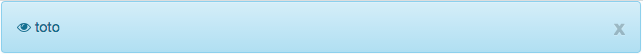
[alert](/rdoc/UiBibz/Ui/Core/Alert.html)

### Breadcrumb (fil d'ariane)

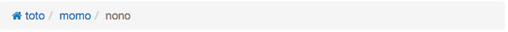
[]
L'élément ```breadcrumb``` à pour ```options``` un Hash acceptant les clefs :

* [status](#status-values)
* [glyph](#glyph-arguments)
* url

L'élément ```link``` est un [component](#component).

```ruby
= breadcrumb do |b|
  - b.link 'toto', url: '#toto', glyph: 'home'
  - b.link 'momo', url: '#momo'
  - b.link 'nono', status: :active
```

### Buttons (Boutons)

#### Button

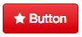

L'élément ```button``` à pour ```options``` un Hash acceptant les clefs :

* [state](#state-values)
* [status](#status-values)
* [glyph](#glyph-arguments)
* [size](#size-values)

```ruby
= button 'Button', { state: :danger, size: :xs, glyph: 'star' } , { class: 'my-button' }
```

#### Button Dropdown

L'élément ```button_dropdown``` accepte pour options les mêmes clefs que l'élément
[dropdown](#dropdown).

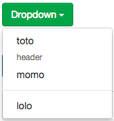
```ruby
= button_dropdown 'Button Dropdown' do |bd|
  - bd.list link_to 'toto', '#'
  - bd.list 'header', type: :header
  - bd.list link_to 'momo', '#'
  - bd.list '---'
  - bd.list link_to 'lolo', '#'
```

#### Button group

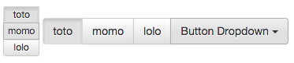

L'élément ```button_group``` à pour ```options``` un Hash acceptant les clefs :

* position (:vertical, :horizontal)
* [size](#size-values)

L'élément ```list``` à pour ```options``` un Hash acceptant les clefs :

* [status](#status-values)
* [state](#state-values)

```ruby
= button_group position: :vertical, size: :xs do
  = button 'toto', status: :active
  = button 'momo'
  = button 'lolo'

= button_group do
  = button 'toto', status: :active
  = button 'momo'
  = button 'lolo'
  = button_dropdown 'Button Dropdown' do |bd|
    - bd.list 'header', type: :header
    - bd.list link_to 'momo', '#'
    - bd.list '---'
    - bd.list link_to 'lolo', '#'
```

#### Button Link (Lien Bouton)


L'élément ```button_link``` à pour ```options``` un Hash acceptant les clefs :

```ruby
= button_link 'Button', { url: '#button', state: :primary, glyph: 'star' }, { class: 'my-button' }
```

#### Button Split Dropdown


L'élément ```button_split_dropdown```accepte pour options les mêmes clefs
que l'élément [dropdown](#dropdown).

```ruby
= button_split_dropdown 'Dropdown', state: :primary do |d|
  - d.list do
    = link_to 'toto', "#"
  - d.list 'header', type: :header
  - d.list link_to 'momo', '#'
  - d.list '---'
  - d.list link_to 'lolo', '#'
```

### Dropdown

L'élément ```dropdown``` à pour ```options``` un Hash acceptant les clefs :

* [state](#state-values)
* [status](#status-values)
* position (:left, :right)

L'élément ```list``` est un [component](#component) qui accepte pour options les clefs :

* type (:header)
* [glyph](#glyph-arguments)

```ruby
= dropdown 'Dropdown', state: :success do |d|
  - d.list do
    = link_to 'toto', "#"
  - d.list 'header', type: :header
  - d.list link_to 'momo', '#'
  - d.list '---'
  - d.list link_to 'lolo', '#'
```

Pour ajouter une ligne séparatrice, il suffit d'insérer 3 "-" à la suite

Exemple :

```
...
d.list '--'
...
```

### Progress Bar

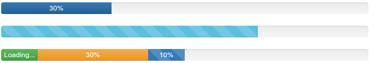

L'élément ```progress_bar``` à pour ```options``` un Hash acceptant les clefs :

* [state](#state-values)
* type (:animated, :striped)
* label - String (default: "percentage%")
* tap - Boolean (true: To add several bars)
* percentage_min - Integer (default: 0)
* percentage_max - Integer (default: 100)
* sr_only - Boolean to show label (default: false)

```ruby
= progress_bar 30
# or
= progress_bar state: :info, sr_only: true, type: :animated do
  = 70
# or
= progress_bar(tap: true) do |pb|
  - pb.bar 10, { state: :success, label: 'Loading...' },{ class: 'test' }
  - pb.bar 30, state: :warning
  - pb.bar(type: :striped) do
    = 10
```

### Glyph


Les glyphs utilisés proviennent de [Font Awesome](http://fontawesome.io/).
L'élément ```glyph``` peut contenir un hash pour ```content```
L'élément ```glyph``` à pour ```options``` un Hash acceptant les clefs :

* size
* type

```ruby
= glyph 'star', { size: 3, type: 'fw' }, class: 'star-exemple'
ou
= glyph { name: 'star', size: 3, type: 'fw' }
```

### Panel

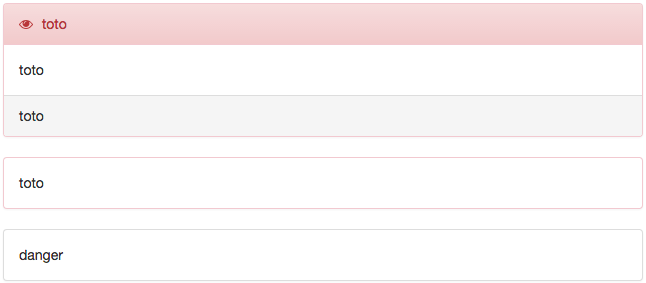

L'élément ```panel``` à pour ```options``` un Hash acceptant les clefs :

* [state](#state)
* tap (true) : permet de créer un header, body et footer

Les éléments ```header```, ```body```,```footer``` sont des éléments [component](#component).

Exemple :

```ruby
= panel 'danger'
# ou
= panel state: :danger do
  = 'toto'
# ou
= panel({ tap: true, state: :danger }, { class: 'exemple' }) |p|
  - p.header 'toto', glyph: 'eye'
  - p.body class: 'my-body' do
    = 'toto'
  - p.footer 'toto'
```

### Table

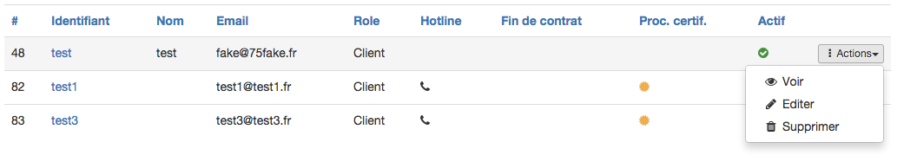

L'élément ```table``` est un tableau composé d'une recherche, une pagination et un trie de colonnes intégrées.
Le tableau est compatible [I18n](http://guides.rubyonrails.org/i18n.html).
Le tableau contient pour chaque ligne un bouton dropdown 'action' avec par défaut
ces 3 actions : voir, éditer, supprimer. Toutes les colonnes sont présentes et
affichées par défaut.

La table doit contenir un store. Ce store doit-être créé dans le controlleur avec la
méthode ```table_search_pagination```.

La méthode ```table_search_pagination``` contient 3 arguments :

* params
* session
* args (optionel)

Exemple :

```ruby
# app/controllers/document_controller.rb
@documents = Document.table_search_pagination(params, session)
```

Dans le model, insérer la méthode ```searchable_attributes``` afin de pouvoir
faire une recherche sur les attributs souhaités.

Exemple :

```ruby
# app/models/document.rb
searchable_attributes :name_fr, :name_en
```

Un champ recherche est disponible dans la vue :

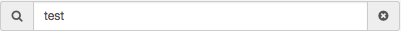

```ruby
= table_search_field store: @documents
```

Une pagination est disponible dans la vue :

```ruby
= table_pagination store: @documents
```

Un champs select par page est disponible dans la vue :

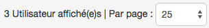

```ruby
= table_pagination_per_page store: @documents
```

#### Simple Example table

Dans le **controlleur**, insérer la méthode ```table_search_pagination```.
La méthode ```table_search_pagination``` contient 3 arguments :

* params
* session
* args

Exemple :

```ruby
# app/controllers/document_controller.rb
@documents = Document.table_search_pagination(params, session)
```

Dans le **model**, insérer la méthode ```searchable_attributes``` afin de pouvoir
faire une recherche sur les attributs souhaités.

Exemple :
```ruby
# app/models/document.rb
searchable_attributes :name_fr, :name_en
```

Dans la **vue**, insérer la méthode ```table``` qui peut contenir plusieurs arguments :

* store (ex: @documents)
* paginable (true, false)
* sortable (true, false)

Une table comporte des **colonnes** et des **actions**.

Exemple :
```ruby
# app/views/documents/index.html.haml
= table store: @documents
```

Les actions par défauts peuvent être modifiées ([voir exemple complexe](#Complex-Example-table)) :

* edit
* view
* delete

Elles sont intégrées à l'intérieur d'un bouton [dropdown](#dropdown).

Exemple :
```ruby
# app/views/documents/index.html.haml
= table store: @documents do |g|
  - g.actions do
    = link_action 'Show', documents_path(:id), glyph: 'eye'
    = link_action 'Edit', edit_document_path(:id), glyph: 'pencil'
    = link_action 'Delete', documents_path(:id), method: :delete, glyph: 'trash', data: { confirm: 'Are you sure?' }
    = link_action "---"
    = link_action 'Duplicate', duplicate_document_path(:id), glyph: 'files-o'
    = link_action 'Alert', alert_document_path(:id), glyph: 'bell'
```

L'ajout de colonnes à travers la méthode ```add``` contient plusieurs arguments :

* name (nom de la colonne)
* data_index (le nom de l'attribut)
* count (utilise la méthode count sur l'élément)
* date_format (formate l'affichage de la date en utilisant la méthode ```strftime``` ex: '%Y/%M/%D')
* format (formate les élements de la colone en utilisant **lambda**)
* link (ajoute un lien où l'expression ```:id``` est parsé et remplacé par l'entier correspondant)
* sort (permet de trier sur des champs )
* custom_sort (indique que le tableau sera triéé d'une manière personnalisée)

```ruby
# app/views/documents/index.html.haml
= table store: @documents do |g|
  - g.columns do |c|
    - c.add { name: '#', data_index: 'id' }
    - c.add { name: 'Name fr', data_index: 'name_fr', link: edit_document_path(:id)}
    - c.add { data_index: 'name_en' }
    - c.add { name: 'Hotline', data_index: 'hotline_access', format: lambda{ |records, record| glyph(record.icon) }}
    - c.add { name: 'Updated at', data_index: 'updated_at', date_format: '%Y' }
```

#### Complex Example table

Si on souhaite voir apparaître certaines liasions avec d'autres tables il faut pour
cela :

Dans le controlleur, insérer la méthode ```table_search_pagination``` en ajoutant
un ```includes``` juste avant.

Exemple :
```ruby
# app/controllers/document_controller.rb
@documents = Document.includes(:users).table_search_pagination(params, session)
```

Dans la vue, insérer la méthod ```table```.
NB: On peut créer ces propres méthodes comme ```user_name``` dans notre model "Document" et
l'appeler comme valeur pour la clef ```data_index```.

```ruby
# app/views/documents/index.html.haml
= table store: @documents do |g|
  - g.columns do |c|
    - c.add { name: 'Users', data_index: 'user_name', sort: "user.name" }
```


#### Ultra Complex Example table

Si l'on souhaite, par exemple, dénombrer des utilisateurs qui ont un lien non
direct avec les documents.
Imaginons par exemple qu'un utilisateur à des produits et que
ces produits contiennent plusieurs documents. On souhaite compter le nombre
d'utilisateurs par document.

On peut ajouter des arguments dans la méthode ```table_search_pagination```
qui vont permettre de faire des jointures.

Exemple :
```ruby
# app/controllers/document_controller.rb
arguments  = { sortable: {
  column: 'users',
  count:  true,
  joins: "LEFT OUTER JOIN documents_products ON documents_products.document_id = documents.id
          LEFT OUTER JOIN products ON products.id = documents_products.product_id
          LEFT OUTER JOIN products_users ON products_users.product_id = products.id
          LEFT OUTER JOIN users ON users.id = products_users.user_id"
} }

@documents = Document.includes(:users).table_search_pagination(params, session, arguments)
```

Ici l'argument sortable signifie que l'on souhaite s'interresser à la
fonctionnalité de trie.

Pour celà il faut :

* définir le nom de la colonne triéé à travers l'argument ```column:``` (string)
* définir si le traitement se fait sur le comptage avec l'argument ```count:```
  (boolean)
* définir la jointure avec l'argument ```joins:``` (string, array, hash)

Dans la vue :

```ruby
# app/views/documents/index.html.haml
= table store: @documents do |g|
  - g.columns do |c|
    - c.add({ name: 'Users', data_index: 'users', count: true, custom_sort: true })
```

#### table I18n

La table est utilisable avec I18n. Les traductions
s'executent par ordre d'importance dans cet ordre précis pour la colonne "name_fr" par exemple.

1. ui_biz.table.headers.document.name_fr
2. ui_biz.table.headers.defaults.name_fr
3. activerecord.attributes.document.name_fr
4. activerecord.attributes.defaults.name_fr

Le placeholder du champ recherche est utilisable et traduisible avec les attributs activerecord dans le fichier locale.

Exemple :

```ruby
# config/locales/fr.yml
...
activerecord:
  models:
      user: 'Utilisateur'
  attributes:
    defaults:
      name_fr: 'Nom fr'
...
```

### Table Panel

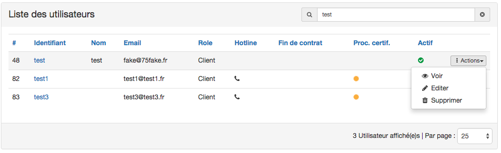

Le composant ```table_panel``` est un [tableau](#table) dans un [panel](#panel).

```ruby
= table_panel store: @users
#ou
= table_panel({ store: @users, tap: true, glyph: 'home', state: :danger }) do |g|
  - g.columns do |cls|
    - cls.column name: '#', data_index: 'id'
    - cls.column name: 'Username', data_index: 'username', link: edit_user_path(:id)
    - cls.column name: 'Name', data_index: 'name'
    - cls.column name: 'Email', data_index: 'email'
    - cls.column name: 'Role', data_index: 'role_name', sort: 'roles.name'
  - g.actions do |acs|
    - acs.action 'Toto', url: edit_user_path(:id), glyph: 'pencil'
    - acs.action "---"
    - acs.action 'momo', url: user_path(:id), glyph: 'eye'

```

### List


Par défaut une liste à pour tag ```<li>```.
Mais elle peut se transformer en lien ```<a>``` à travers l'option ```type:```.
Par défaut le tag ```<li>``` est présent.

```ruby
= list_group type: :link do |lg|
  - lg.list 'Momo', { state: :success, glyph: 'home' }, { href: '#Momo' }
  - lg.list({ tap: true, status: :active }, { href: '#Toto' }) do |l|
    - l.header 'My title'
    - l.body 'My title'
# ou
= list_group do |lg|
  - lg.list 'Momo', glyph: 'home', badge: 2
  - lg.list 'Toto'
```

### Nav


Par défaut la navigation comporte des onglets "tab".
L'élément ```nav``` accepte en option les arguments :

* type (:pills, :tabs)
* position (:justified, :stacked)
* tap (true)

L'élement link est un [component](#component).

```ruby
= nav(type: :pills, position: :justified, tap: true) do |d|
  d.link 'Test', url: '#test', badge: 6
  d.link 'Test2', url: '#test2', status: :active
```

### Etiquette

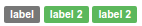


NB : Les méthodes ```Tag, label``` sont déjà utilisées par Rails.
L'élément ```etiquette``` à pour ```options``` un Hash acceptant les clefs :

* [state](#state-values)
* [glyph](#glyph-values)

Exemple :

```ruby
= etiquette 'label'
= etiquette 'label 2', state: :success
= etiquette 'label 2', state: :danger
```

### Row

Le composant row génére une div avec la class row.

 ```ruby
= row class: 'toto' do
  = content
# => <div class='row toto'>content</div>
```

### Col

L'élément ```col``` est un [composant](#composant) qui accèpte en arguments :

* num
* offset
* size

ou

* un tableau de hashes avec les arguments ```num```, ```offset``` et ```size``` à l'intérieur.

Ces paramètres génèrent les classes qui seront insérées dans la div avec la classe
col.


```ruby
= col({num: 2, size: :lg}, class: 'test') do
  = content

# => <div class='col-lg-2 test'>content</div>

# ou
= col([{ offset: 1, size: :xs}, { num: 3}], class: 'test') do
  = content

# => <div class='col-xs-offset-1 col-md-3 test'>content</div>
```

### Grid

Une grid est un composant qui est composé de 5 vues :

* top
* right
* bottom
* left
* center

La vue **center** est obligatoire.
Une vue à pour arguments :

* position (:top, :left, :bottom, :right, :center)
* num (1..12) 12 étant le nombre limite de colonnes utilisable dans boostrap.

L'argument ```position``` détermine la position de la vue et l'argument ```num``` determine
le nombre de colonnes occupées par la vue.

```ruby
= grid do |g|
  - g.view num: 3, position: :left do
    = list_group(type: :link) do |lg|
      - lg.list 'Link 1', { url: '#link1' }
      - lg.list 'Link 2', { url: '#link1', status: :active }
      - lg.list 'Link 1', { url: '#link1' }
      - lg.list 'Link 3', { url: '#link1' }
      - lg.list 'Link 4', { url: '#link1' }
  - g.view({ position: :top}) do
    = button_group(type: :toolbar) do
      = button 'option 1'
      = button 'option 2'
      = button 'option 3'
  - g.view position: :center do
    = table store: @users, type: :bordered
  - g.view position: :bottom do
    = 'bottom'

= grid do |g|
  - g.view num: 5, position: :left do
    = 'left'
  - g.view position: :right do
    = 'right'
  - g.view({ position: :top}, { class: 'success'}) do
    = 'top'
  - g.view position: :center do
    = 'center'
  - g.view position: :bottom do
    = 'bottom'
```

### Arguments and Values

#### Status values
* :active
* :disable

#### Size values
* :xs
* :sm
* :lg

#### State values
* :default
* :primary
* :info
* :success
* :warning
* :danger

#### Glyph arguments
* name
* size
* type

# Plus de détails

Pour plus d'informations, vous pouvez accéder à la documentation rdoc en
générant cette dernière :

```
rake rdoc
```

# Conflits

Certaines méthodes dans le helper peuvent être en conflit avec d'autres
librairies. Le cas échéant, vous pouvez utiliser directement la librairie UiBibz
comme ci-dessous.

Exemple :

```ruby
UiBibz::Ui::Panel.new('Exemple', { state: :success }, { class: 'exemple'}).render
# au lieu de
panel 'Exemple', { state: :success }, { class: 'exemple' }
```

# Roadmap :

Pour la V2.

* créer des stores pour les listes, breadcrumb
* créer une meilleure documentation
* créer d'autres extensions, plugins et une guideline
* donner le choix de la dépendence boostrap et awesomefont en CDN ou en local
* mise à jour vers bootstrap 4
* créer Ui-Bibz Core à partir de cette librairie ( pour l'insérer dans un nouveau
  framework Ui-Bibz utilisant simple_form pour les champs formulaires ).
...

