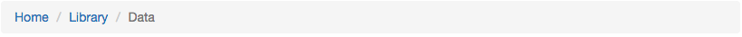
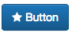
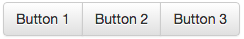

[](https://travis-ci.org/thooams/Ui-Bibz)
[](https://codeclimate.com/github/thooams/Ui-Bibz)
[](https://codeclimate.com/github/thooams/Ui-Bibz)

This project rocks and uses MIT-LICENSE.


# UiBibz
> Ui Bibz est un framework d'interface permettant de construire une interface
> très rapidement à l'aide de Ruby on Rails et de Boostrap.
> Ui Bibz est compatible HAML et SASS. Le framework requière **Ruby 2** et **Rails 4**.


Tous les composants de Ui Bibz comportent des *options* et des *html_options*.
Les composants sont basées sur la logique et le comportement de [link_to](http://api.rubyonrails.org/classes/ActionView/Helpers/UrlHelper.html#method-i-link_to) présent dans Ruby on Rails
et acceptent les blocks.

Ui Bibz charge la librairie [boostrap](http://getbootstrap.com/) et
[awesomefont](http://fontawesome.io/).


## Installation

Ajouter la gem dans Rails :

```ruby
gem "ui_bibz", github: 'thooams/ui_bibz', tag: 'v0.5.0'
```

Lancer la command suivante :

```console
bundle install
```

Placer la ligne suivante dans ```/app/views/layouts/application.rb```
```ruby
 = ui_bibz_meta_links
```

Exemple :
```ruby
<!DOCTYPE html>
<html>
<head>
  ...
  <%= ui_bibz_meta_links %>
  ...
</head>
<body>
</body>
</html>
```


## Utilisation

### Breadcrumb (fil d'ariane)


```ruby
= breadcrumb class: 'exemple' do
  = content_tag :li, content_tag(:a, "Home")
  = content_tag :li, content_tag(:a, "Library")
  = content_tag :li, content_tag(:a, "Data", class: 'active')

```

### Buttons (Boutons)
#### Button
Les boutons acceptent l'option ```type:``` avec pour arguments :

* :default
* :sucess,
* :primary
* :info
* :warning
* :danger

Les boutons acceptent l'option ```glyph:``` ([doc](#glyph)).


```ruby
= button 'Button', { type: :danger, glyph: 'star' } , { class: 'my-button' }
```

#### Button Link (Lien Bouton)
Le lien bouton accèpte les mêmes paramètres que "button". À ceci près, que le
lien bouton est un lien ```link_to```.


```ruby
= button_link 'Button', "#", { type: :primary, glyph: 'star', class: 'my-button' }
```

#### Button Group (Liens groupés)


```ruby
= button_group class: 'exemple' do
  = button 'Button 1'
  = button 'Button 2'
  = button 'Button 3'
```

### Dropdown (Menu déroulant)
#### Dropdown (Menu déroulant)

Le menu déroulant accepte les options :

* ```glyph:``` ([doc](#glyph))
* ```type:``` avec pour arguments :
  * :default
  * :sucess,
  * :primary
  * :info
  * :warning
  * :danger
* ```position:```
  * left
  * right

L'ajout d'un séparateur dans le menu s'effectue avec 3 tirets : '---'

```ruby
= dropdown 'Action', glyph: { name: 'star', type: 'fw' }, position: 'left', type: :default,  class: 'exemple' do
  = content_tag :li, content_tag(:a, 'Menu 1')
  = content_tag :li, content_tag(:a, 'Menu 2')
  = '---'
  = content_tag :li, content_tag(:a, 'Menu 3')
```

#### Dropdown Button

### Glyph
Les glyphs utilisés proviennent de [Font Awesome](http://fontawesome.io/).
Les glyphs acceptent les options:

* name
* size
* type


```ruby
= glyph 'star'
ou
= glyph { name: 'star', size: 3, type: 'fw' }
```

### Grid

Une grid est un tableau avec recherche, pagination et trie des colonnes
intégrées. La grid est entièrement traduisible : ```I18n ```. Elle contient par
défaut 3 actions : éditer, voir et supprimer. Toutes les colonnes sont
présentent et affichées par défaut.


#### Simple grid

Dans le controlleur, insérer la méthode ```grid_search_pagination```.
La méthode ```grid_search_pagination``` contient 3 arguments :

* params
* session
* args

Exemple :
```ruby
# app/controllers/document_controller.rb
@documents = Document.grid_search_pagination(params, session)
```

Dans le model, insérer la méthode ```searchable_attributes``` afin de pouvoir
faire une recherche pour les attributs souhaités.

Exemple :
```ruby
# app/models/document.rb
searchable_attributes :name_fr, :name_en
```

Dans la vue, insérer la méthode ```grid``` qui peut contenir plusieurs arguments :

* ```store```  (constante : créé dans le controller)
* ```paginable``` (booléen : active la pagination)
* ```sortable```  (booléen : active le trie par colonne)

Une grid comporte des **colonnes** et des **actions**.

Exemple :
```ruby
# app/views/documents/index.html.haml
= grid store: @documents
```

Les actions par défauts peuvent être modifiées (voir exemple complexe) :

* edit
* view
* delete

Elles sont intégrées à l'intérieur d'un bouton [dropdown](#dropdown).

Exemple :
```ruby
# app/views/documents/index.html.haml
= grid store: @documents do |g|
  - g.actions do
    = link_action 'Show', documents_path(:id), glyph: 'eye'
    = link_action 'Edit', edit_document_path(:id), glyph: 'pencil'
    = link_action 'Delete', documents_path(:id), method: :delete, glyph: 'trash', data: { confirm: 'Are you sure?' }
    = link_action "---"
    = link_action 'Duplicate', duplicate_document_path(:id), glyph: 'files-o'
    = link_action 'Alert', alert_document_path(:id), glyph: 'bell'
```

L'ajout de colonnes à travers la méthode ```add``` contient plusieurs arguments :

* name (nom de la colonne)
* data_index (le nom de l'attribut)
* count (utilise la méthode count sur l'élément)
* date_format (formate l'affichage de la date en utilisant la méthode ```strftime``` ex: '%Y/%M/%D')
* format (format les élement de la colone en utilisant **lambda**)
* link (ajoute un lien où :id est parsé et remplacé par l'entier correspondant)
* sort (permet de trier sur des champs )
* custom_sort (indique que le tableau sera triéé d'une manière personnalisée)

```ruby
# app/views/documents/index.html.haml
= grid store: @documents do |g|
  - g.columns do |c|
    - c.add { name: '#', data_index: 'id' }
    - c.add { name: 'Name fr', data_index: 'name_fr', link: edit_document_path(:id)}
    - c.add { data_index: 'name_en' }
    - c.add { name: 'Hotline', data_index: 'hotline_access', format: lambda{ |records, record| glyph(record.icon) }}
    - c.add { name: 'Updated at', data_index: 'updated_at', date_format: '%Y' }
```

#### Complex grid

Si on souhaite voir apparaître des liasions avec d'autres tables il faut pour
cela :

Dans le controlleur, insérer la méthode ```grid_search_pagination``` en ajoutant
un includes juste avant.

Exemple :
```ruby
# app/controllers/document_controller.rb
@documents = Document.includes(:users).grid_search_pagination(params, session)
```

Dans la vue, insérer la méthod ```grid```.
NB: On peut créer ces propres méthodes comme ```user_name``` dans notre model "Document" et
l'utiliser dans le data_index.

```ruby
# app/views/documents/index.html.haml
= grid store: @documents do |g|
  - g.columns do |c|
    - c.add { name: 'Users', data_index: 'user_name', sort: "user.name" }
```


#### Ultra Complex grid

Si l'on souhaite, par exemple, compter des utilisateurs qui ont un lien non
direct avec les documents. Imaginons qu'un utilisateur à des produits et que
ces produits contiennent plusieurs documents. On souhaite compté le nomble
d'utilisateurs par document.

On va pouvoir utiliser des arguments dans la méthode ```grid_search_pagination```
qui vont permettre des jointures.

Exemple :
```ruby
# app/controllers/document_controller.rb
arguments  = { sortable: {
  column: 'users',
  count:  true,
  joins: "LEFT OUTER JOIN documents_products ON documents_products.document_id = documents.id
          LEFT OUTER JOIN products ON products.id = documents_products.product_id
          LEFT OUTER JOIN products_users ON products_users.product_id = products.id
          LEFT OUTER JOIN users ON users.id = products_users.user_id"
} }

@documents = Document.includes(:users).grid_search_pagination(params, session,
arguments)
```
Ici l'argument sortable signifie que l'on souhaite s'occuper de la
fonctionnalité de trie.
Il faut :

* définir le nom de la colonne triéé à travers l'argument ```column:``` (string)
* définir si le traitement se fait sur le comptage avec l'argument ```count:```
  (boolean)
* définir la jointure avec l'argument ```joins:``` (string, array, hash)

Dans la vue :

```ruby
# app/views/documents/index.html.haml
= grid store: @documents do |g|
  - g.columns do |c|
    - c.add({ name: 'Users', data_index: 'users', count: true, custom_sort: true })
```

#### Grid I18n

La grid est entièrement traduisible avec I18n. L'importance des traductions
s'execute dans cette ordre pour la colonne "name_fr" par exemple.

1. ui_biz.grid.headers.document.name_fr
2. ui_biz.grid.headers.defaults.name_fr
3. activerecord.attributes.document.name_fr
4. activerecord.attributes.defaults.name_fr

Le placeholder du champ recherche est traduisible avec les attributs activerecord.

### List

### Nav


# A faire :

* intégrer la recherche avec les liaisons

